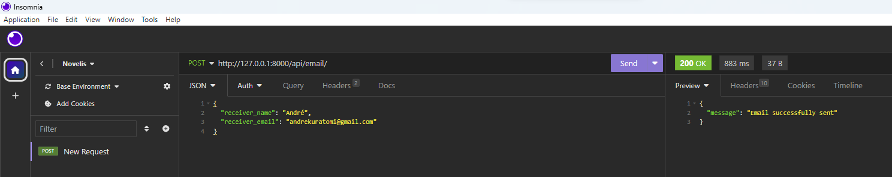

## python_django_tables_filter_mail

- [Sobre](#sobre)
- [Instalação](#instalação)
- [Comandos](#Comandos)
- [Documentação](#documentação)

<br>

# Sobre

<p>A API <b>python_django_tables_filter_mail</b> se propõe a manipular planilhas, filtra-las e envia-las por email.

Esta aplicação utiliza o framework <b>Django</b> e o banco de dados <b>SQLite3</b>.</p>
<br>

# Instalação

<h5>0. Primeiramente, é necessário já ter instalado na própria máquina:</h5>

- O versionador de codigo <b>[Git](https://git-scm.com/downloads)</b>.

- A linguagem de programacao <b>[Python](https://www.python.org/downloads/)</b>.

- Um <b>editor de código</b>, conhecido também como <b>IDE</b>. Por exemplo, o <b>[Visual Studio Code (VSCode)](https://code.visualstudio.com/)</b>.

- Uma <b>ferramenta cliente de API REST</b>. Por exemplo, o <b>[Insomnia](https://insomnia.rest/download)</b> ou o <b>[Postman](https://www.postman.com/product/rest-client/)</b>.

- <p> E versionar o diretório para receber o clone da aplicação:</p>

```
git init
```

<br>
<h5>1. Fazer o clone do reposítório <span>python_django_tables_filter_mail</span> na sua máquina pelo terminal do computador ou pelo do IDE:</h5>

```
git clone https://github.com/AndreKuratomi/vba_python_django.git
```

<p>Entrar na pasta criada:</p>

```
cd python_django_tables_filter_mail
```

Após feito o clone do repositório KenzieDoc, instalar:

O ambiente virtual e atualizar suas dependências com o seguinte comando:

```
python3 -m venv venv --upgrade-deps
```

Ative o seu ambiente virtual com o comando:

```
source/venv/bin/activate
```

Instalar suas dependências:

```
pip install -r requirements.txt
```

E rodar a aplicação:

```
code .
```

# Comandos

Inserir tabela no projeto vinda do sharepoint:

./

```
cd management/commands/robot_sharepoint && python3 robot_to_manage_sharepoint.py
```

Filtrar a planilha por cor e inseri-la numa banco de dados SQLite3 e transforma-la numa model django:

```
cd .. && python3 tables_to_db.py
```

Ativar django:

```
cd ../.. && python3 manage.py runserver
```

E envia-la por email usando um cliente API (futuramente o front) como na imagem a seguir:



<br>

# Documentação

Para ter acesso ao descrições detalhes das rotas e seus retornos, conferir documentação completa no link a seguir:

(link)